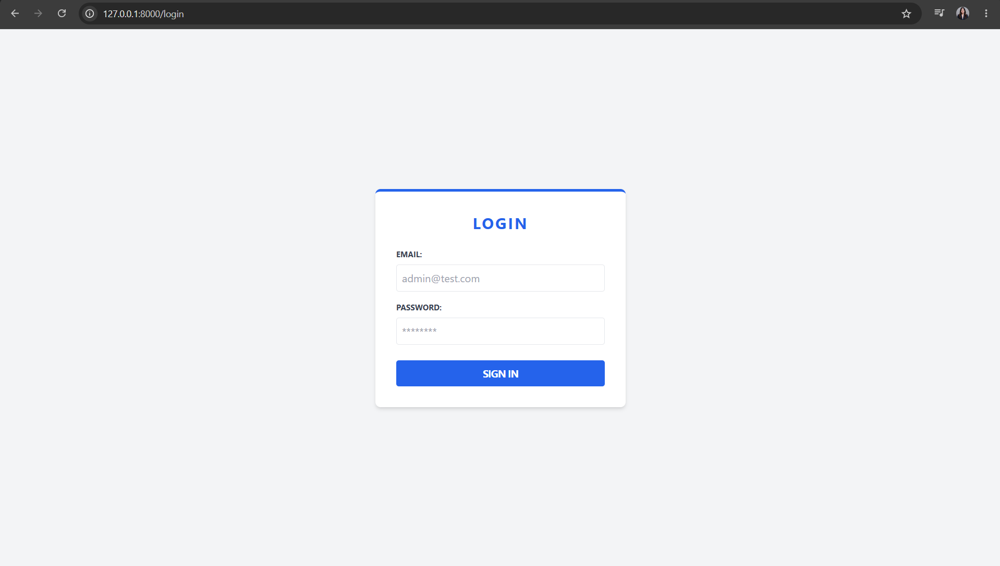
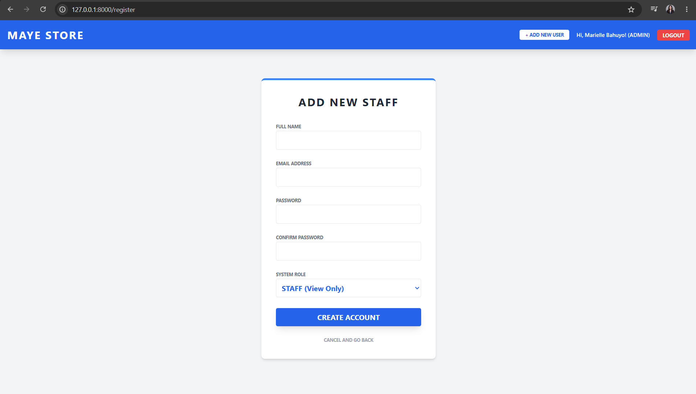
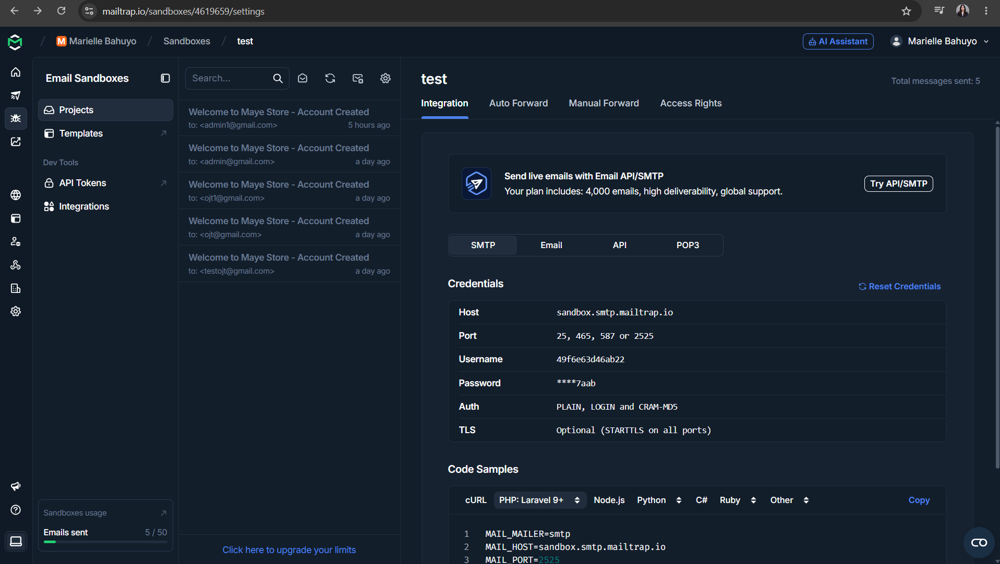
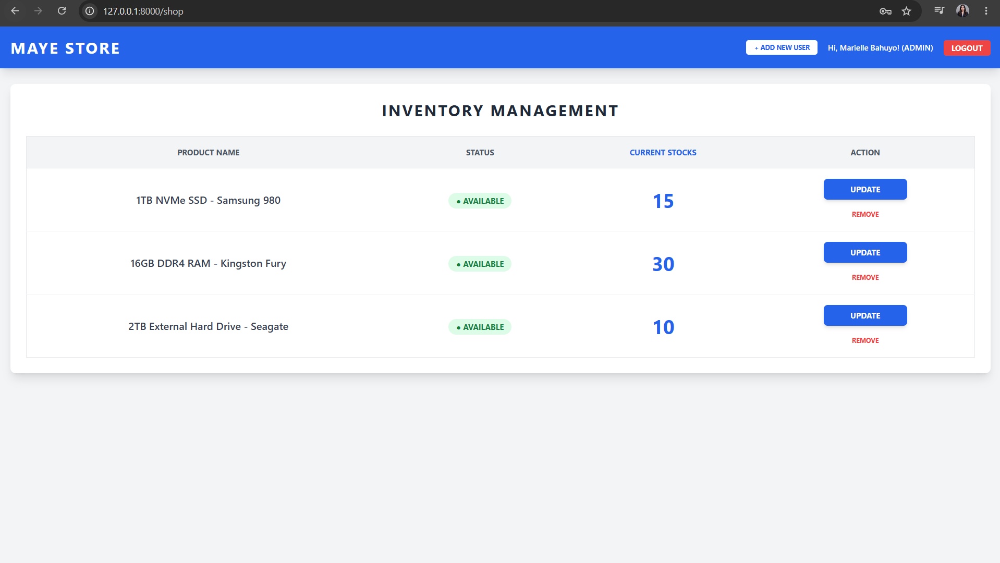

# 🛍️ Maye Store - Inventory & User Management System

Isang web-based application na binuo para sa aking **On-the-Job Training (OJT)** sa Customer Frontline Solutions. Ang system na ito ay tumutulong sa pag-manage ng inventory at pag-automate ng staff registration gamit ang email notifications.

## 🚀 Features
* **User Authentication**: Secure login at registration for user.
* **Email Notifications**: Automated welcome emails using **Mailtrap** SMTP.
* **Inventory Management**: Real-time tracking of products in store.
* **Personalized UI**: Custom Blade templates for dashboard and email views.

## 🛠️ Tech Stack
* **Framework**: Laravel 11
* **Language**: PHP
* **Database**: MySQL
* **Tools**: Mailtrap (SMTP Testing), Vite (Asset Bundling), GitHub

## 📸 Screenshots
*(Dito mo ilalagay ang screenshots ng app mo para makita agad ni Boss!)*

### Registration & Email Success

   
  
  

### Dashboard Overview

  

## ⚙️ Installation
1. Clone the repo: `git clone https://github.com/vanillamaye/Laravel-project-implementation.git`
2. Install dependencies: `composer install` & `npm install`
3. Setup `.env`: Copy `.env.example` to `.env` and configure your database and Mailtrap credentials.
4. Run migrations: `php artisan migrate`
5. Start the server: `php artisan serve`
